# Practical Exploitation of Linux eBPF Verifier Vulnerabilities (LTS 6.8)


> **Course**: Security Verification and Testing - Second Year, First Semester  
> **Author**: Renato Mignone  
> **Date**: December 2025

---

## Abstract

This project explores the security boundaries of **eBPF (extended Berkeley Packet Filter)**, a revolutionary technology that allows user-defined programs to run safely inside the Linux kernel. While eBPF's verifier is designed to guarantee memory safety and prevent malicious code execution, certain logic bugs can potentially bypass these protections.

The work is structured in three phases:
1. **Understanding eBPF** — A comprehensive introduction to eBPF architecture, its verifier, and why it matters for kernel security.
2. **Prior Theoretical Assessment** — Analysis of inherited work from a previous team who identified 60+ potential vulnerabilities based on ISO-IEC TS 17961-2013, classifying ~10 as theoretically exploitable.
3. **Practical Exploitation** — Engineering functional Proofs of Concept (PoCs) that demonstrate real kernel impact on LTS 6.8.

---

## Table of Contents

1. [What is eBPF?](#what-is-ebpf)
   - [Origins and Evolution](#origins-and-evolution)
   - [Architecture Overview](#architecture-overview)
   - [The eBPF Verifier](#the-ebpf-verifier)
   - [Program Types and Use Cases](#program-types-and-use-cases)
   - [Security Implications](#security-implications)
2. [Threat Model](#threat-model)
3. [Why Target LTS 6.8?](#why-target-lts-68)
4. [eBPF Exploitation Primitives](#ebpf-exploitation-primitives)
5. [Inherited Work: What the Previous Team Did](#inherited-work-what-the-previous-team-did)
   - [The ISO-IEC TS 17961-2013 Standard](#the-iso-iec-ts-17961-2013-standard)
   - [What is XDP SynProxy?](#what-is-xdp-synproxy)
   - [Theoretical vs. Practical: The Gap](#theoretical-vs-practical-the-gap)
6. [My Objective: Practical Exploitation](#my-objective)
7. [Repository Structure](#repository-structure)
8. [Quick Start](#quick-start-using-inherited-infrastructure)
9. [Progress Tracking](#progress-tracking)
10. [References](#references)

---

## What is eBPF?

<br>

### Origins and Evolution

**eBPF (extended Berkeley Packet Filter)** is a revolutionary technology that originated from the classic BPF (Berkeley Packet Filter) created in 1992 for network packet filtering. While classic BPF was limited to simple packet inspection (used by tools like `tcpdump`), eBPF has evolved into a general-purpose **in-kernel virtual machine** capable of running sandboxed programs in the Linux kernel.

<p align="center">
  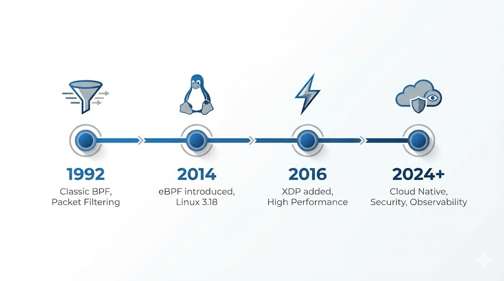
</p>

**Timeline:**
* **1992**: BPF created (packet filtering only).
* **2014**: eBPF introduced in Linux 3.18 (Extended instruction set, Maps, Helpers).
* **2016**: XDP (eXpress Data Path) added for programmable network processing at the driver level.
* **2020+**: eBPF becomes ubiquitous for Observability, Security, and Networking.

---

### Architecture Overview

eBPF programs are written in a restricted C dialect, compiled to eBPF bytecode, verified by the kernel, and JIT-compiled to native machine code for execution.

<p align="center">
  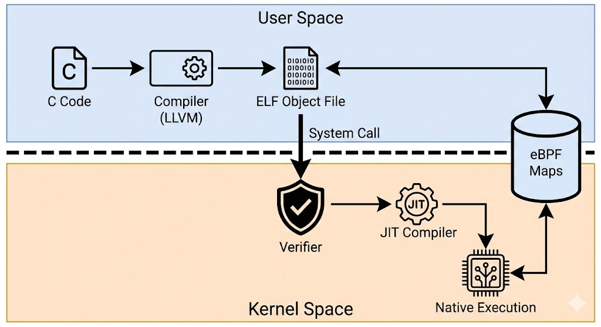
</p>

**Key Components:**

| Component | Description |
|-----------|-------------|
| **eBPF Bytecode** | Platform-independent instruction set (11 registers, 64-bit) |
| **Verifier** | Static analyzer ensuring program safety before execution |
| **JIT Compiler** | Translates bytecode to native CPU instructions |
| **Maps** | Key-value stores for sharing data between eBPF programs and user space |
| **Helpers** | Kernel functions callable from eBPF (e.g., `bpf_map_lookup_elem`) |
| **Hooks** | Attachment points in kernel (kprobes, tracepoints, XDP, TC, LSM) |

---

### The eBPF Verifier

The verifier is the **security cornerstone** of eBPF. It performs static analysis on every program before allowing it to run in the kernel. Its goal is to guarantee:

<p align="center">
  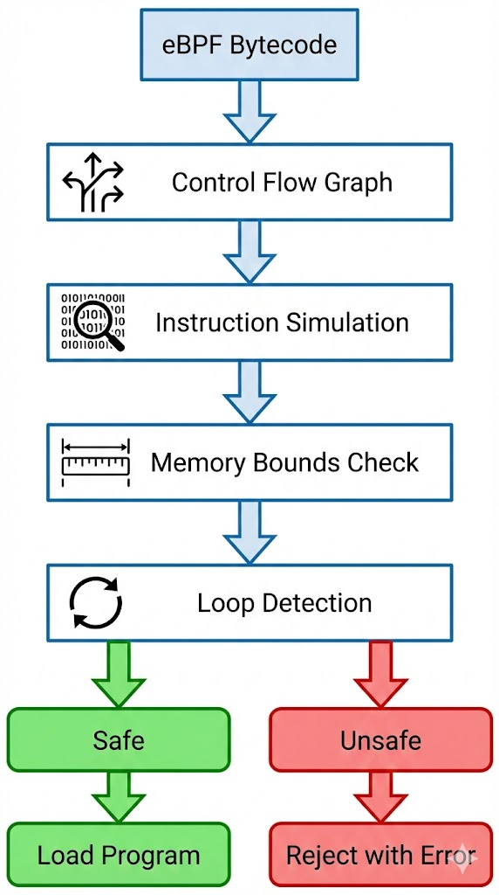
</p>

1. **Memory Safety** — No out-of-bounds reads/writes
2. **Termination** — Program will always complete (no infinite loops)
3. **Valid Operations** — Only allowed helpers and operations
4. **Type Safety** — Correct use of pointers and data types

**Verifier Analysis Stages:**
1.  **CFG Construction**: Build Control Flow Graph and identify execution paths.
2.  **Instruction Walk**: Simulate each instruction and track register states.
3.  **Bounds Checking**: Verify memory accesses and track pointer arithmetic.
4.  **Loop Detection**: Ensure bounded iteration.
5.  **Helper Validation**: Check argument types.

**Verifier Limitations (The Attack Surface):**

The verifier is complex (~20,000 lines of code in `kernel/bpf/verifier.c`) and must balance security, usability, and performance. This complexity creates potential for **logic bugs** where:
- The verifier's model of program behavior differs from actual execution.
- Edge cases in type tracking allow invalid operations.
- Pointer arithmetic confuses the verifier's bounds tracking.

**These verifier bugs are the focus of this project.**

---

### How the Verifier Tracks State (The Logic)

To ensure safety without executing the code, the verifier simulates every instruction and maintains a **state** for each of the 11 registers (`R0`-`R10`). A vulnerability occurs when this internal state gets out of sync with the actual runtime machine state.

**What the Verifier tracks per register:**
1.  **Type**: Is it a **SCALAR** (number) or a **POINTER** (to memory/map)?
    * *Exploit Path:* If we can trick the verifier into thinking a **SCALAR** is a **POINTER**, we can read arbitrary kernel memory.
2.  **Range (`tnum`)**: What is the min/max value this register holds?
    * *Exploit Path:* If the verifier thinks a value is `0-100` but at runtime it is `1000`, bounds checks are bypassed (OOB R/W).
3.  **Offset**: Where does this pointer point relative to the base object?

> **The "Pruning" Problem:** To save time, if the verifier sees a code path that looks similar to one it already checked, it skips it ("pruning"). Many logic bugs hide here—where the verifier prunes a path it *thought* was safe, but actually wasn't.

---

### Program Types and Use Cases

eBPF supports multiple program types, each attaching to different kernel hooks:

| Program Type | Hook Point | Use Case |
|--------------|------------|----------|
| `BPF_PROG_TYPE_XDP` | Network driver (pre-stack) | DDoS mitigation, load balancing |
| `BPF_PROG_TYPE_SCHED_CLS` | Traffic Control (TC) | Packet filtering, NAT |
| `BPF_PROG_TYPE_KPROBE` | Kernel functions | Tracing, debugging |
| `BPF_PROG_TYPE_TRACEPOINT` | Static kernel events | Performance monitoring |
| `BPF_PROG_TYPE_LSM` | Linux Security Modules | Security policies |
| `BPF_PROG_TYPE_SOCKET_FILTER` | Socket layer | Packet inspection |

**XDP (eXpress Data Path)** is particularly interesting for security research because it runs at the **earliest point** in the network stack, has **direct memory access**, and is **performance-critical**.

---

### Security Implications

eBPF's ability to run custom code in kernel space makes it a **high-value target** for attackers.

<p align="center">
  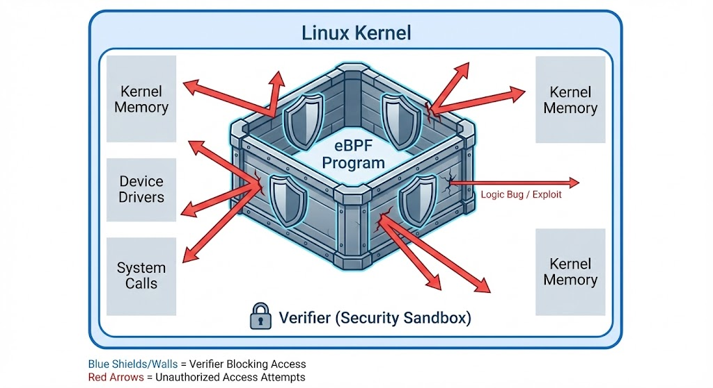
</p>

* **Intended Boundaries**: Cannot access arbitrary memory, cannot call arbitrary functions.
* **If Verifier Bypassed**: Arbitrary kernel read (Info disclosure), Arbitrary kernel write (Privilege escalation).

**Historical eBPF Vulnerabilities:**

| CVE | Year | Description |
|-----|------|-------------|
| CVE-2020-8835 | 2020 | Verifier bounds tracking error, arbitrary R/W |
| CVE-2021-3490 | 2021 | ALU32 bounds tracking, privilege escalation |
| CVE-2021-31440 | 2021 | Bounds propagation bug |
| CVE-2022-23222 | 2022 | Pointer arithmetic confusion |
| CVE-2023-2163 | 2023 | Verifier log buffer overflow |

This project focuses on identifying and exploiting similar **verifier logic bugs** in LTS 6.8.

---

## Threat Model

Before diving into exploitation, it's essential to define the threat model — who is the attacker, what capabilities do they have, and what are they trying to achieve?

### Attacker Profile

| Attribute | Description |
|-----------|-------------|
| **Access Level** | Unprivileged user access to a Linux system (LTS 6.8) |
| **Capabilities** | Can load eBPF programs (requires `CAP_BPF` or root, depending on kernel config) |
| **Limitations** | Cannot directly modify kernel code, modules, or bypass secure boot |

### Attack Goals

| Goal | Impact | Severity |
|------|--------|----------|
| **Arbitrary Kernel Read** | Leak kernel addresses (defeat KASLR), credentials, cryptographic keys | High |
| **Arbitrary Kernel Write** | Modify `cred` structure → privilege escalation to root | Critical |
| **Code Execution** | Overwrite function pointers → execute arbitrary kernel code | Critical |

### Attack Surface

The attack surface is specifically the **eBPF verifier's static analysis logic**:
- Discrepancies between verifier's model and actual runtime behavior
- Edge cases in type tracking (SCALAR vs. POINTER confusion)
- Bounds tracking errors in arithmetic operations
- Pruning logic that incorrectly assumes paths are equivalent

### Out of Scope

- Kernel exploits not involving eBPF (use-after-free, race conditions)
- Hardware vulnerabilities (Spectre, Meltdown)
- Social engineering or physical access attacks
- Denial of Service (we focus on privilege escalation)

---

## Why Target LTS 6.8?

The choice of **Linux Kernel LTS 6.8** as the target is deliberate:

| Reason | Explanation |
|--------|-------------|
| **Long Term Support** | LTS kernels are deployed in production for 2-6 years, meaning vulnerabilities have prolonged impact |
| **Wide Deployment** | Used in enterprise servers, cloud infrastructure (AWS, GCP, Azure), and embedded systems |
| **Security Research Value** | Vulnerabilities discovered here have real-world implications |
| **Verifier Maturity** | Contains the latest verifier improvements — if we can bypass it, older kernels are likely vulnerable too |
| **Reproducibility** | Stable, well-documented version ensures consistent testing environment |
| **eBPF Feature Set** | Supports all modern eBPF features (BTF, CO-RE, ringbuf) that might introduce new attack vectors |

> **Note**: Findings on LTS 6.8 may also apply to other kernel versions with similar verifier code. Backporting analysis would be a valuable extension of this work.

---

## eBPF Exploitation Primitives

Once the verifier is bypassed, attackers leverage specific **primitives** to achieve their goals. Understanding these is crucial for both offense and defense.

### 1. Out-of-Bounds Read (OOB-R)

```
┌─────────────────────────────────────────────────────┐
│  Verifier believes: ptr can access [0, 100]         │
│  Reality:           ptr can access [0, 1000]        │
│                                                     │
│  Result: Read kernel memory beyond allowed bounds   │
└─────────────────────────────────────────────────────┘
```

**Use Cases:**
- **Defeat KASLR**: Leak kernel base address to calculate gadget locations
- **Credential Theft**: Read `task_struct->cred` to extract UIDs, capabilities
- **Key Extraction**: Leak cryptographic keys from kernel memory

---

### 2. Out-of-Bounds Write (OOB-W)

```
┌─────────────────────────────────────────────────────┐
│  Verifier believes: ptr can write [0, 64]           │
│  Reality:           ptr can write [0, 512]          │
│                                                     │
│  Result: Overwrite adjacent kernel structures       │
└─────────────────────────────────────────────────────┘
```

**Use Cases:**
- **Privilege Escalation**: Overwrite `cred->uid` and `cred->gid` to 0 → instant root
- **Security Bypass**: Modify `cred->cap_effective` to grant all capabilities
- **Code Execution**: Overwrite function pointers in kernel structures

---

### 3. Type Confusion

```
┌─────────────────────────────────────────────────────┐
│  Verifier believes: R1 = SCALAR (safe number)       │
│  Reality:           R1 = POINTER (kernel address)   │
│                                                     │
│  Result: Arithmetic on "numbers" actually moves     │
│          pointers to arbitrary kernel locations     │
└─────────────────────────────────────────────────────┘
```

**Use Cases:**
- Convert controlled integers into arbitrary kernel pointers
- Bypass pointer arithmetic restrictions
- Access memory regions the verifier thought were unreachable

---

### Common Exploitation Flow

<p align="center">
  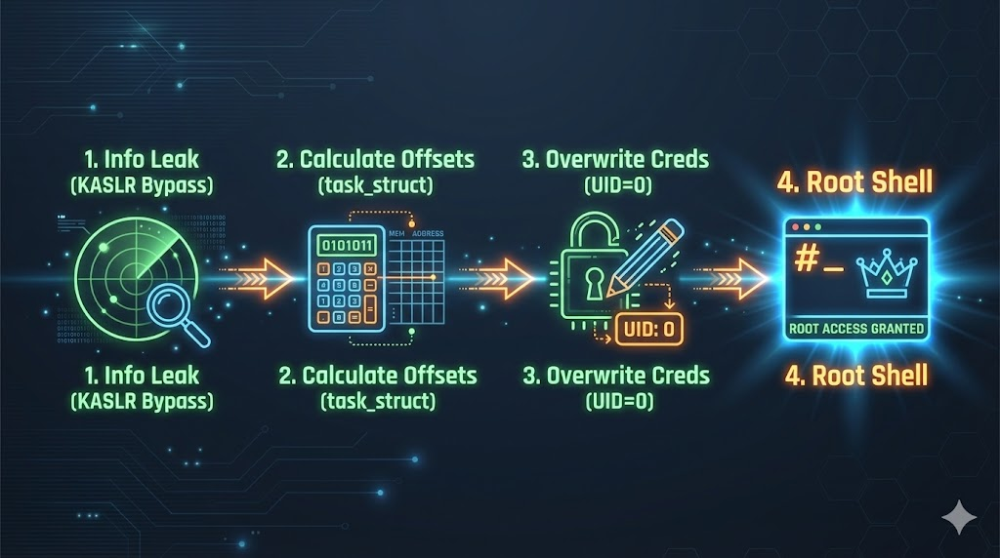
</p>

---

## Inherited Work: What the Previous Team Did

The repository `ebpf-exploitability-test/` contains work from a previous team (Francesco Rollo, Gianfranco Trad, Giorgio Fardo, Giovanni Nicosia) who performed a **theoretical vulnerability assessment** based on **ISO-IEC TS 17961-2013** (C Secure Coding Standard).

---

### The ISO-IEC TS 17961-2013 Standard

The previous team based their vulnerability assessment on **ISO-IEC TS 17961-2013**, titled *"Information technology — Programming languages, their environments and system software interfaces — C Secure Coding Rules"*.

This technical specification defines **46 rules** that identify common programming patterns in C that lead to undefined behavior, security vulnerabilities, or reliability issues. Each rule is numbered (5.1 through 5.46) and categorized by vulnerability type:

| Category | Rule Examples | Vulnerability Type |
|----------|---------------|--------------------|
| **Memory Safety** | 5.2, 5.20, 5.21, 5.35 | Buffer overflows, dangling pointers, uninitialized memory |
| **Type Safety** | 5.1, 5.10, 5.16 | Pointer casts, integer conversions, aliasing violations |
| **Control Flow** | 5.4, 5.17 | Missing switch defaults, assignment in conditionals |
| **Data Handling** | 5.24, 5.40, 5.46 | Format strings, tainted input propagation |
| **Pointer Operations** | 5.22, 5.36 | Invalid pointer arithmetic, pointer comparisons |

#### Why This Standard?

The team systematically applied each of these 46 rules to the XDP SynProxy code, asking:

> *"If we intentionally violate this rule, will the eBPF verifier catch it?"*

This approach provides **comprehensive coverage** — rather than hunting for specific bugs, they tested the verifier against a standardized catalog of known vulnerability patterns.

---

#### Rules NOT Applicable to eBPF

Of the 46 rules, **22 are not applicable** to eBPF due to fundamental architectural constraints:

| Constraint | Affected Rules | Reason |
|------------|----------------|--------|
| **No Dynamic Memory** | 5.2, 5.18, 5.21, 5.23, 5.34 | No `malloc()` or `free()` in eBPF |
| **No Signal Handling** | 5.3, 5.5, 5.7 | No signal handlers in kernel context |
| **No File Operations** | 5.12, 5.27, 5.41, 5.43 | No FILE structs or stdio |
| **No Standard Library** | 5.8, 5.19, 5.29, 5.32, 5.37, 5.42 | Limited libc access |
| **Not Security-Relevant** | 5.25, 5.38, 5.44 | Discarded as not useful for exploitation |

**Applicable Rules**: ~24 rules could be tested in the eBPF environment.

**Key Finding**: Of those 24 applicable rules, **21 violations passed the verifier** — a concerning result that motivated this follow-up exploitation work.

---

### What is XDP SynProxy?

The previous team focused **exclusively** on testing vulnerabilities within the XDP SynProxy implementation. To understand why this is a significant target, we need to understand the problem it solves.

#### The SYN Flood Attack

<p align="center">
  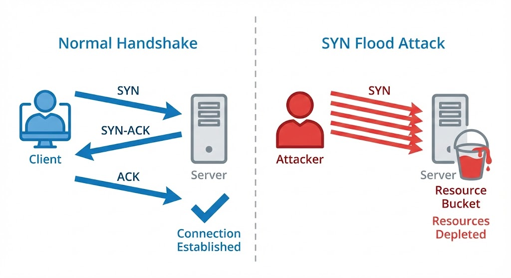
</p>

A **SYN flood** is a type of Denial-of-Service (DoS) attack that exploits the TCP three-way handshake:

**The problem**: Each SYN packet causes the server to allocate a **Transmission Control Block (TCB)** and wait for the ACK. Attackers send thousands of SYN packets with spoofed source IPs, exhausting the server's connection table while never completing the handshake.

---

#### The SYN Proxy Solution

<p align="center">
  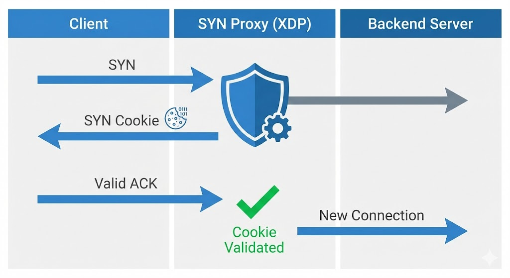
</p>

A **SYN Proxy** acts as an intermediary that validates clients before forwarding connections to the real server:

**SYN Cookies**: Instead of storing state, the proxy encodes connection information (source IP, port, timestamp) into the **sequence number** of the SYN-ACK. When the client responds with ACK, the proxy can validate the cookie mathematically without having stored any state. Fake clients with spoofed IPs never receive the SYN-ACK, so they can't complete the handshake.

---

#### Why XDP for SYN Proxy?

<p align="center">
  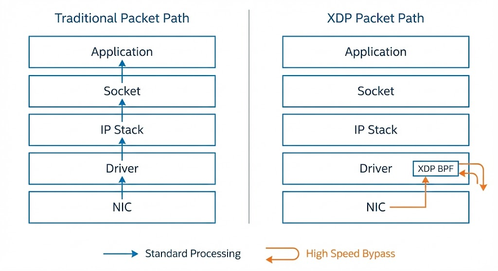
</p>

Traditional SYN proxies operate in user space or higher in the kernel stack, which introduces latency. **XDP (eXpress Data Path)** solves this by running the SYN proxy logic at the **earliest possible point** — directly in the network driver:

**XDP SynProxy advantages**:
- **Line-rate processing**: Can handle millions of packets per second
- **Zero-copy**: Operates directly on packet memory in the driver
- **Early drop**: Malicious packets never enter the kernel stack
- **CPU efficient**: No context switches, minimal overhead

---

#### The Target: `xdp_synproxy_kern.c`

The file `xdp_synproxy_kern.c` is an eBPF/XDP implementation of a SYN proxy, taken from the **Linux kernel selftests**. It performs:
1. **Packet parsing**: Ethernet → IP → TCP header dissection
2. **SYN detection**: Identifies incoming TCP SYN packets
3. **Cookie generation**: Creates cryptographic SYN cookies
4. **SYN-ACK crafting**: Builds response packets with embedded cookies
5. **ACK validation**: Verifies returning ACKs contain valid cookies
6. **Connection forwarding**: Passes validated connections to the kernel

The previous team chose this target because:
- It's **real production code** from Linux kernel selftests
- It involves **complex pointer arithmetic** for packet parsing
- It uses **multiple eBPF features** (maps, helpers, tail calls)
- It's **security-critical** — bugs here could disable DDoS protection or leak information
- It's **performance-critical** — must process packets at wire speed

---

#### Important: XDP SynProxy is User Code, Not Kernel Code

<p align="center">
  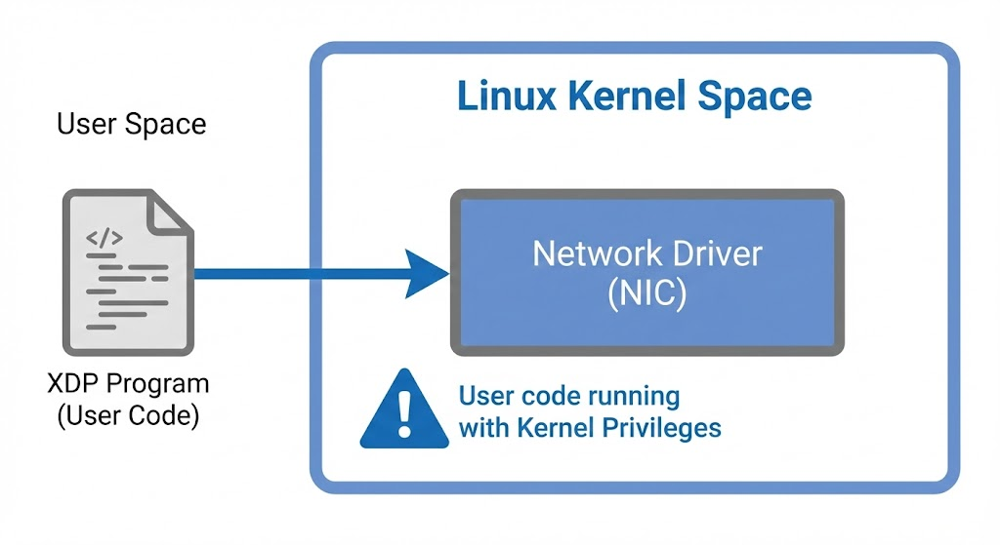
</p>

A crucial distinction to understand: `xdp_synproxy_kern.c` is **not** part of the Linux kernel itself. It's an **eBPF program** — user-provided code that gets loaded *into* the kernel at runtime:

This is the **power and danger** of eBPF: anyone with appropriate privileges can load custom code that runs inside the kernel with full kernel privileges.

---

#### The Verifier as Security Gatekeeper

<p align="center">
  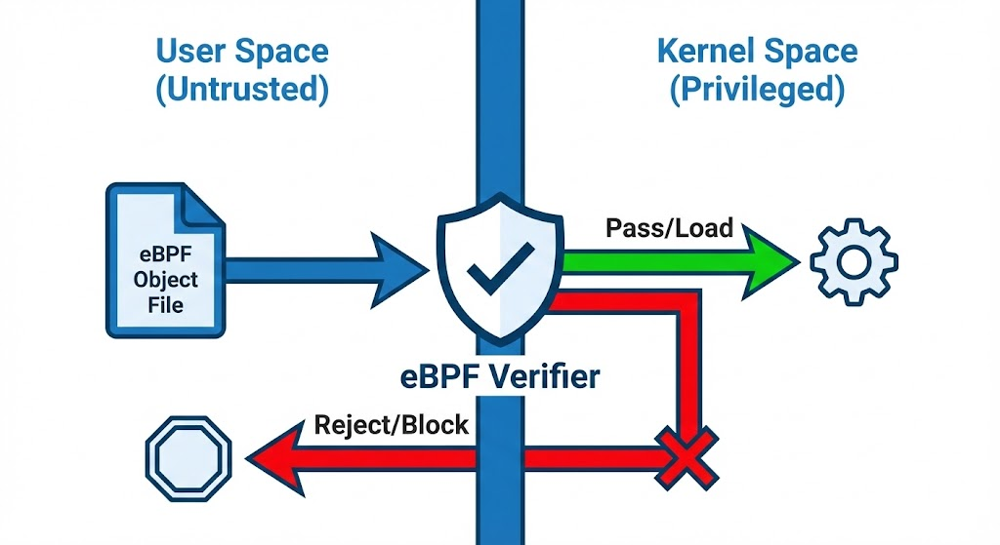
</p>

The eBPF verifier exists specifically to prevent malicious or buggy user code from compromising the kernel.

---

#### What the Testing Actually Proves

When we inject vulnerable code via patches and test against the verifier:

<p align="center">
  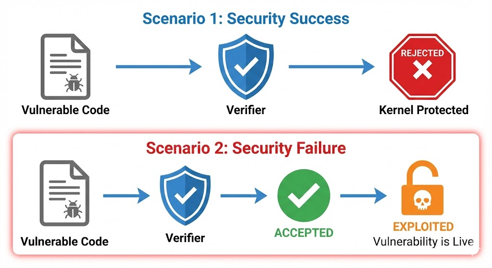
</p>

#### The "Translation Gap": C Vulnerabilities vs. Bytecode Reality

A critical insight from this research is that **a vulnerability in the C source code does not guarantee an exploit in the kernel**, even if the verifier allows it to load.

This discrepancy exists because the vulnerability must survive a complex translation chain:

1.  **C Source**: The vulnerability exists here (e.g., ISO-17961 violation).
2.  **LLVM Compilation**: The compiler translates C to eBPF Bytecode.
    * *The Filter Effect:* The compiler may optimize away the vulnerable logic, dead-code eliminate the branch, or translate a complex memory violation into a benign register operation.
3.  **JIT Compilation**: The kernel translates Bytecode to Native Machine Code (x86/ARM).

<p align="center">
  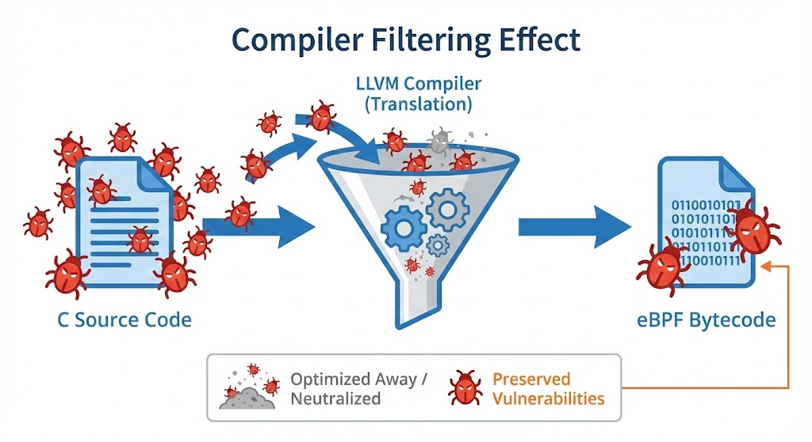
</p>

**Why "Verifier Pass" $\neq$ "Exploit":**
For a vulnerability to be exploitable, it must be **preserved** through this translation. Many "theoretical" C bugs disappear because eBPF's memory model (512-byte stack, 64-bit registers) forces the compiler to generate code that, by coincidence or constraint, is safe at runtime.

**Example**: A buffer overflow in C (`memcpy(dst, src, user_len)`) might compile to eBPF instructions that use bounded loop unrolling, where the compiler statically limits the copy to a safe maximum regardless of `user_len`.

**Conclusion**: We are not just exploiting C code; we are exploiting the **Bytecode** that the C code produces.

**Implication for This Project**: When developing PoCs, examining the C source alone is insufficient. I must verify vulnerabilities survive compilation by analyzing the eBPF bytecode with tools like `llvm-objdump -d` or `bpftool prog dump xlated`.

---

#### Why This Matters

The previous team found **~21 cases** where the verifier **incorrectly accepted** vulnerable code:

| Outcome | Count | Meaning |
|---------|-------|---------|
| Verifier blocked | ~14 | Security works ✓ |
| Compiler blocked | ~8 | Never reached verifier |
| **Verifier passed + Exploitable** | **~9** | **Security failure — PRIMARY TARGETS** |
| **Verifier passed + Limited** | **~12** | **Uncertain — SECONDARY TARGETS** |
| Verifier passed + Safe | ~17 | Logic bugs but no security impact |

The **9 "Exploitable"** and **12 "Limited"** cases represent situations where:
1. Intentionally vulnerable code was written
2. The eBPF verifier **failed to detect** the vulnerability
3. The code was **loaded into the kernel**
4. The vulnerability is now **potentially exploitable** with kernel privileges

**My task**: Prove these theoretical vulnerabilities are actually dangerous by building working exploits.

---

### Theoretical vs. Practical: The Gap

Understanding the distinction between the previous team's work and mine is crucial:

| Aspect | Previous Team (Theoretical) | My Work (Practical) |
|--------|----------------------------|---------------------|
| **Core Question** | "Does this code pass the verifier?" | "Can I actually exploit this to get root?" |
| **Analysis Type** | Source code analysis | Bytecode + runtime analysis |
| **Output** | Classification (YES/LIMITED/NO) | Working PoC exploits |
| **Validation** | Static assessment | Dynamic exploitation |
| **Conclusion** | "This COULD be dangerous" | "This IS dangerous, here's proof" |
| **Deliverable** | Vulnerability catalog | Functional exploit code |

**The Gap**: Knowing a vulnerability *exists* is different from proving it's *exploitable*. Many theoretical vulnerabilities fail in practice due to:
- Compiler optimizations neutralizing the bug
- Additional runtime checks not visible in static analysis  
- Memory layout constraints preventing useful corruption
- Missing primitives to chain into full exploitation

**My Contribution**: Bridge this gap by transforming theoretical findings into practical proof.

---

### Their Testing Environment


The previous team implemented a **full client-server architecture** for practical eBPF/XDP vulnerability testing. Their setup allows you to:

- Run a netcat server and client on separate hosts (or host and VM), with the XDP SynProxy eBPF program acting as a proxy in the middle.
- Use the `start_session.sh` script to launch a tmux session that sets up:
  - The XDP SynProxy loader (attaches the eBPF program to the network interface)
  - A netcat server (listening for TCP connections)
  - Kernel trace output (for debugging and observing eBPF behavior)
- Simulate real network communication, with the XDP SynProxy program intercepting and processing packets between the client and server.

This architecture enables you to test how injected vulnerabilities in the eBPF program can be exploited via network packets, providing a realistic and interactive environment for security research.

**How it works in practice:**
- The netcat server is always running on the VM, listening for incoming TCP connections on port 80.
- The XDP SynProxy eBPF program is attached to the VM's network interface and intercepts all incoming packets before they reach the server.
- You use a netcat client (typically from your host machine) to connect to the VM's IP and port 80, sending crafted network packets.
- This setup allows you to observe how the XDP program processes, blocks, or is potentially exploited by these packets.

<p align="center">
  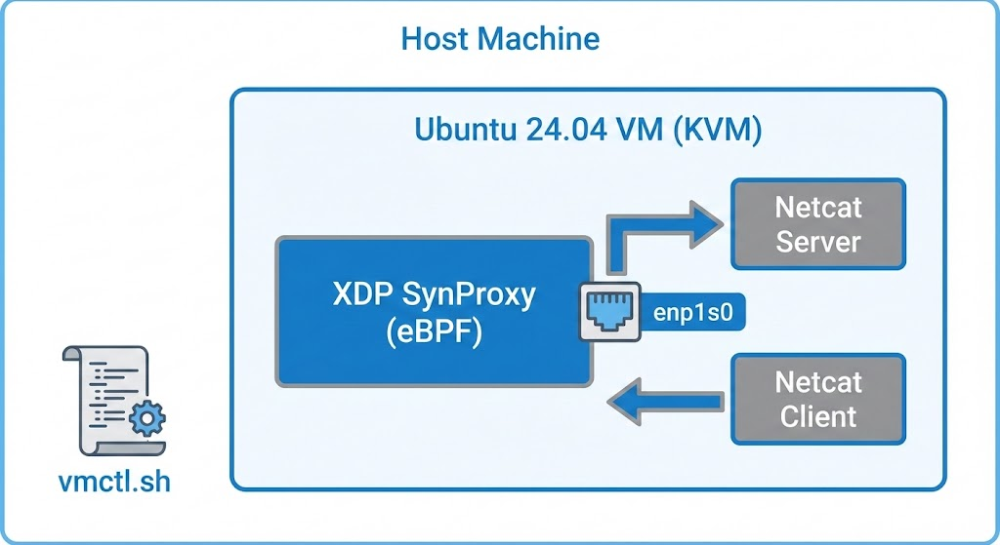
</p>

#### VM Infrastructure (`virt/`)

The `vmctl.sh` script provides complete VM lifecycle management:

```bash
# VM Management Commands
./vmctl.sh create ~/.ssh/id_rsa.pub   # Create and provision new VM
./vmctl.sh connect                     # Connect to VM console
./vmctl.sh destroy                     # Tear down VM
```

**VM Specifications:**
| Parameter | Value |
|-----------|-------|
| Base Image | Ubuntu 24.04 (Noble) Cloud Image |
| Memory | 4096 MB |
| vCPUs | 2 |
| Disk | 20 GB |
| Hypervisor | KVM/QEMU via libvirt |

**Cloud-Init Provisioning**: The VM is automatically configured on first boot using `cloud-init` with:
- Pre-installed development tools (`clang`, `llvm`, `bpftool`, `make`)
- SSH key injection for passwordless access
- Network configuration for XDP testing
- All required eBPF development dependencies

#### Key Design Decisions

- **Single VM topology**: The team initially attempted a 3-veth (virtual Ethernet) topology to simulate client/proxy/server separation. However, virtual interfaces caused **checksum offloading issues** with SYN cookies — the kernel's checksum calculation differed from hardware expectations. They simplified to a single real interface where the XDP program, server, and client all run within or connect to the same VM.

- **tmux testing sessions**: The `start_session.sh` script creates a multi-pane tmux session with:
  - Pane 1: XDP SynProxy program output
  - Pane 2: Netcat server listening for connections
  - Pane 3: Packet monitoring / test commands

---

### Understanding Patches and `git apply`

> ⚠️ **Terminology Clarification**: In standard software development, a "patch" typically means a **fix** for a bug or vulnerability. **In this project, the meaning is inverted**: our patches **inject vulnerabilities** into clean code, not remove them. We use the Git patch format purely as a **delivery mechanism** to systematically introduce specific, isolated vulnerabilities into the `xdp_synproxy_kern.c` codebase for testing purposes.

A **patch** (or diff) is a text file that describes the differences between two versions of a file. While patches are traditionally used to distribute bug fixes, in this research context they serve as **vulnerability injection vectors** — each patch transforms the clean, safe `xdp_synproxy_kern.c` into a version containing a specific ISO-17961 vulnerability.

#### Why Use Patches for Vulnerability Injection?

| Benefit | Description |
|---------|-------------|
| **Isolation** | Each vulnerability exists in its own patch — no cross-contamination |
| **Reproducibility** | Anyone can recreate the exact vulnerable state |
| **Reversibility** | Easy to apply and revert (`git apply -R`) |
| **Documentation** | Patch metadata includes vulnerability description |
| **Automation** | xvtlas can iterate through patches programmatically |

---

#### Anatomy of a Patch File

```diff
From b5856aa7d76351adf1a201097c3a950c9e94502d Mon Sep 17 00:00:00 2001
From: author <email@example.com>
Date: Wed, 27 Aug 2025 13:10:03 +0200
Subject: [PATCH] feat(5.10a_exploit): intptrconv

---
 XDPs/xdp_synproxy/xdp_synproxy_kern.c | 251 ++++++++++++++++++++++++++
 1 file changed, 251 insertions(+)

diff --git a/XDPs/xdp_synproxy/xdp_synproxy_kern.c b/XDPs/xdp_synproxy/xdp_synproxy_kern.c
index 0d0d990..34a1474 100644
--- a/XDPs/xdp_synproxy/xdp_synproxy_kern.c      ← Original file
+++ b/XDPs/xdp_synproxy/xdp_synproxy_kern.c      ← Modified file
@@ -373,6 +431,9 @@ struct header_pointers {        ← Location marker
 static __always_inline int tcp_dissect(void *data, void *data_end,
 				       struct header_pointers *hdr)
 {
+	__u32 data_base_truncated;               ← Lines starting with + are ADDED
+	void *calculated_ptr;
+
 	hdr->eth = data;
-	old_line_here                            ← Lines starting with - are REMOVED
 	if (hdr->eth + 1 > data_end)
```

**Key elements:**
- **Header**: Commit metadata (author, date, message)
- **File path**: Which file(s) are modified
- **Hunks** (`@@`): Location markers showing line numbers
- **`+` lines**: Code being added
- **`-` lines**: Code being removed
- **Context lines**: Unchanged lines for positioning

#### Git Apply Command

Git provides the `git apply` command to apply patches to the working directory:

```bash
# Apply a patch (modifies files but doesn't create a commit)
git apply patches/5_10a_exploit_intptrconv/0001-feat-5_10a_exploit.patch

# Check if patch would apply cleanly (dry-run)
git apply --check patches/5_10a_exploit_intptrconv/0001-feat-5_10a_exploit.patch

# Apply in reverse (remove the patch changes)
git apply -R patches/5_10a_exploit_intptrconv/0001-feat-5_10a_exploit.patch

# Alternative: git am creates a commit from the patch
git am patches/5_10a_exploit_intptrconv/0001-feat-5_10a_exploit.patch
```

#### Workflow in This Project

<p align="center">
  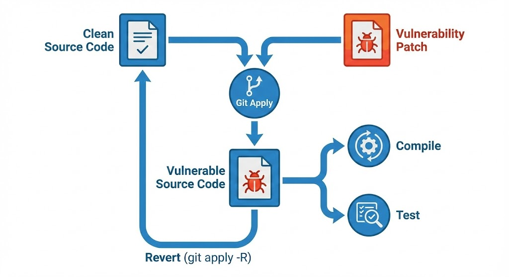
</p>


This approach allows:
- **Clean separation**: Each vulnerability is isolated in its own patch
- **Easy testing**: Apply one patch, test, revert, apply next
- **Version control**: Patches are trackable and reviewable
- **Reproducibility**: Anyone can recreate the exact vulnerable state

---

### The xvtlas Automation Tool

**xvtlas** (XDP Verifier Testing Launch Automation Suite) is a custom Go tool created by the team to automate the repetitive workflow of testing vulnerability patches.

#### Why They Built It

Testing 60+ vulnerability patches manually would require:
1. Apply patch to base file
2. Compile with clang/LLVM
3. Load program with bpftool
4. Capture verifier output
5. Record results
6. Revert patch
7. Repeat...

xvtlas automates this entire pipeline:

<p align="center">
  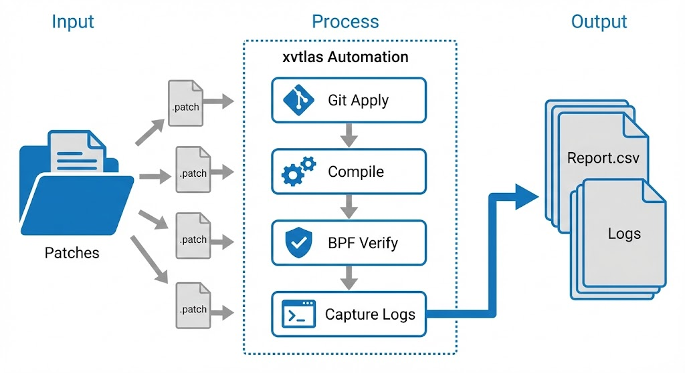
</p>

#### Usage Modes

**1. Batch Testing (All Patches)**
```bash
./xvtlas --export "./output/" \
         --kernel "6.8" \
         --patch-path ./patches/ \
         --base-file ./xdp_synproxy_kern.c \
         --save-logs --verbose
```
Processes all patches and generates a comprehensive CSV report.

**2. Single Patch Interactive Mode**
```bash
./xvtlas --run-single "./patches/5_10a_exploit/*.patch" \
         --base-file "./xdp_synproxy_kern.c"
```
Applies one patch, compiles, and opens a tmux session for manual testing.

**3. Cleanup**
```bash
./xvtlas --destroy
```
Reverts git state and cleans up temporary files from previous sessions.

#### Output Structure

```
xvtlas_output/
├── report.csv              # Summary: patch, compiled?, verified?, loaded?
├── 5_06a_argcomp/
│   ├── make.log            # Compiler output and warnings
│   └── verifier.log        # eBPF verifier output
├── 5_10a_exploit_intptrconv/
│   ├── make.log
│   └── verifier.log
└── ...
```

---

### Their Methodology

<p align="center">
  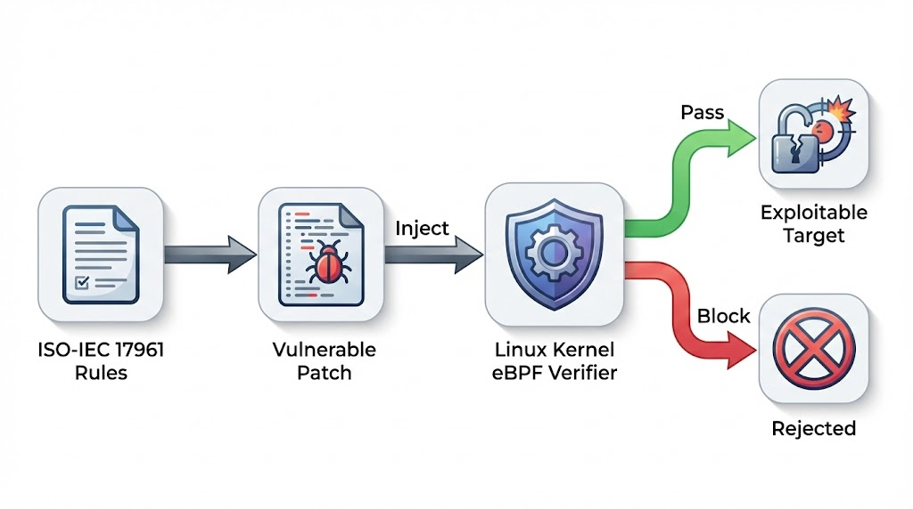
</p>

They applied 46 C vulnerability rules to the target code to test the verifier's response.

---

### What They Produced

| Artifact | Description |
|----------|-------------|
| **60+ vulnerability patches** | Each implements a specific ISO-IEC TS 17961-2013 rule violation |
| **Base target: `xdp_synproxy_kern.c`** | Real XDP SYN proxy from Linux kernel selftests |
| **xvtlas tool** | Go automation suite for patch/compile/verify workflow |
| **patches.csv** | Summary table with exploitability classification |
| **Detailed documentation** | 1500+ lines explaining each vulnerability |

---

### Their Results Summary

* **60 patches total**
    * 8 compilation failures (rejected before verifier).
    * 14 blocked by eBPF verifier ✓ (security works).
    * 19 passed verifier but "not exploitable" (memory bounds still enforced).
    * **9 passed verifier AND marked "exploitable"** (These are my primary targets).
    * **12 passed verifier with "limited" exploitability** (Secondary targets).

---

### Vulnerabilities Marked as "Exploitable"

| Patch | ISO Rule | Vulnerability Type | Their Assessment |
|-------|----------|-------------------|------------------|
| `5_06a_argcomp` | 5.6 | Function pointer mismatch | Register/stack corruption |
| `5_06b_argcomp` | 5.6 | Wrong argument count | Stack memory overwrite |
| `5_10a_exploit_intptrconv` | 5.10 | Pointer truncation bypass | **Info disclosure** |
| `5_14_nullref` | 5.14 | Null pointer dereference | Invalid memory access |
| `5_17_swtchdflt` | 5.17 | Missing switch default | Undefined firewall behavior |
| `5_20a_libptr` | 5.20 | Buffer overflow (8 bytes) | Adjacent stack corruption |
| `5_20c_libptr` | 5.20 | Type confusion overflow | 12-byte buffer overflow |
| `5_35_uninit_mem` | 5.35 | Uninitialized memory read | Kernel stack data leak |
| `5_35a_unint_mem` | 5.35 | Uninitialized memory read | Kernel stack data leak |

---

### Vulnerabilities Marked as "Limited" Exploitability

These vulnerabilities passed the verifier but have uncertain or constrained exploitation potential:

| Patch | ISO Rule | Vulnerability Type | Their Assessment |
|-------|----------|-------------------|------------------|
| `5_06d_argcomp` | 5.6 | Wrong argument types | Value truncation (localized impact) |
| `5_14a_nullref` | 5.14 | Null pointer dereference | Invalid access, no escape path |
| `5_16b_signconv` | 5.16 | Signed conversion | Logic errors only |
| `5_33a_restrict` | 5.33 | Restrict pointer violation | Logic/data corruption in stack |
| `5_33b_restrict` | 5.33 | Restrict pointer violation | Local stack data corruption |
| `5_36a_ptrobj` | 5.36 | Pointer comparison UB | Memory layout information leak |
| `5_36b_ptrobj` | 5.36 | Context pointer comparison | Kernel layout info disclosure |
| `5_36c_ptrobj` | 5.36 | Map pointer comparison | Heap organization leak |
| `5_39_taintnoproto` | 5.39 | Tainted function pointer | Unpredictable logic behavior |
| `5_45_invfmtstr` | 5.45 | Invalid format strings | Address leak via logging |
| `5_46b_taintsink` | 5.46 | Tainted memory copy | Attacker-controlled packet alteration |

---

### Vulnerabilities Marked as "Not Exploitable"

These vulnerabilities were either blocked by the compiler, blocked by the verifier, or passed but had no security impact:

**Blocked by Compilation Errors (8 patches):**
| Patch | Reason |
|-------|--------|
| `5_06c_argcomp` | Conflicting types for function |
| `5_13_objdec` | Conflicting types for variable |
| `5_13b_objdec` | Conflicting types for variable |
| `5_22d_invptr` | Array subscript out of bounds |
| `5_24a_usrfmt` | Incompatible pointer types |

**Blocked by eBPF Verifier (12 patches):**
| Patch | Verifier Error |
|-------|----------------|
| `5_4a_boolasgn` | Infinite loop detected |
| `5_4b_boolasgn` | Infinite loop detected |
| `5_06e_argcomp` | R1 type=scalar expected=map_ptr |
| `5_10a_intptrconv` | Pointer arithmetic with <<= prohibited |
| `5_10b_intptrconv` | R1 invalid mem access 'scalar' |
| `5_14b_nullref` | R7 invalid mem access 'map_value_or_null' |
| `5_16a_signconv` | R8 offset outside packet |
| `5_20b_libptr` | Invalid indirect access to stack |
| `5_22c_invptr` | Invalid access to context parameter |
| `5_24b_usrfmt` | Invalid access to context parameter |
| `5_35b_unint_mem` | R1 invalid mem access 'scalar' |
| `5_40_taintformatio` | Invalid indirect access to stack |
| `5_46a_taintsink` | Unbounded min value not allowed |
| `5_46c_taintsink` | Address R11 invalid (VLA attempt) |

**Passed Verifier but Not Exploitable (19 patches):**
| Patch | Reason |
|-------|--------|
| `5_01a/b/c_ptrcomp` | Memory bounds still enforced by verifier |
| `5_9_padcomp` | Logic non-determinism only, no memory exposure |
| `5_11_alignconv` | Logical misinterpretation, not memory exploitable |
| `5_11a/c_alignconv` | Logical misinterpretation, not memory exploitable |
| `5_15_addrescape` | Dangling pointer but stack managed per-packet |
| `5_15a/b_addrescape` | Dangling pointer but stack managed per-packet |
| `5_22_invptr` | Verifier-enforced memory bounds |
| `5_22b/e/f_invptr` | Logical misinterpretation only |
| `5_26a-e_diverr` | Division by zero results in 0, no crash |
| `5_28_strmod` | Read-only memory, program terminates |
| `5_30_intoflow` | Two's complement arithmetic, no memory violation |
| `5_31a/b_nonnullcs` | Controlled memory layout required |

---

### Complete Vulnerability Summary

```
Total: 60 patches tested
         │
         ├─── YES (Exploitable): 9 patches ────────────► PRIMARY TARGETS
         │    └── Verifier bypassed, real security impact possible
         │
         ├─── LIMITED (Uncertain): 12 patches ─────────► SECONDARY TARGETS  
         │    └── Passed verifier, constrained exploitation potential
         │
         └─── NO (Not Exploitable): 39 patches
              ├── 8 blocked by compiler
              ├── 14 blocked by verifier ✓ (security works)
              └── 17 passed but no security impact
```
<p align="center">
  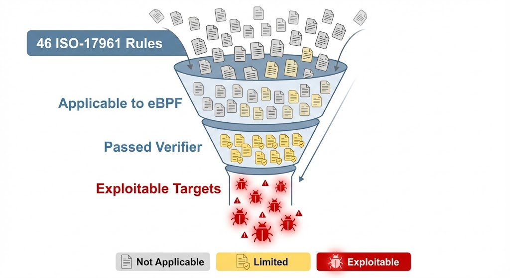
</p>

**Potential investigation scope: 21 patches (9 YES + 12 LIMITED)**

---

### What They Did NOT Do

- ❌ Create actual working exploits
- ❌ Achieve arbitrary kernel read/write
- ❌ Demonstrate privilege escalation
- ❌ Validate impact on real kernel versions

They proved vulnerabilities **can bypass the verifier**, but stopped at theoretical classification.

---

## Repository Structure

```text
Project_EBPF/
├── README.md                          # This file
├── report/                            # My exploitation reports (TODO)
├── src/                               # My PoC code (TODO)
│
└── ebpf-exploitability-test/          # INHERITED FROM PREVIOUS TEAM
    └── codebase/
        ├── README.md                  # Their documentation
        ├── docs/
        │   └── ISO-IEC-TS-17961-2013.pdf
        │
        ├── virt/                      # VM management
        │   ├── vmctl.sh               # Create/destroy/connect to test VM
        │   └── meta-data.yaml
        │
        ├── XDPs/
        │   ├── xdp_synproxy/          # Main target
        │   │   ├── xdp_synproxy_kern.c    # Base vulnerable program
        │   │   ├── Makefile
        │   │   ├── patches/           # 60+ vulnerability patches
        │   │   │   ├── 5_10a_exploit_intptrconv/
        │   │   │   ├── 5_14_nullref/
        │   │   │   ├── 5_20a_libptr/
        │   │   │   └── ...
        │   │   ├── patches.csv        # Summary of all patches
        │   │   ├── apply_rules.sh
        │   │   ├── start_session.sh
        │   │   └── kill_session.sh
        │   │
        │   ├── minimal/               # Minimal exploit examples
        │   │   └── 5_10a_exploit.c
        │   │
        │   └── tools/                 # BPF headers
        │
        ├── xvtlas/                    # Automation tool (Go)
        │   ├── main.go
        │   ├── xvtlas                 # Pre-compiled binary
        │   └── README.md
        │
        └── xvtlas_output/             # Previous test results
            ├── report.csv
            └── [per-patch logs]/
```

---

## My Objective


My work **builds directly on this existing client-server/XDP SynProxy architecture**. Since the XDP program operates at the network interface, having two hosts (client and server) communicating through the proxy is essential for realistic exploitation.

**My objective:**
- Leverage the previous team's infrastructure to perform practical exploitation.
- Use network packets as the attack vector: generate and send them from a netcat client (on the host) to the netcat server (on the VM), with the XDP SynProxy eBPF program in the middle.
- Trigger and exploit vulnerabilities injected into the XDP interface via eBPF patches, by crafting specific network traffic.
- Demonstrate, with real network traffic, which vulnerabilities are exploitable in practice and document the exploitation process.

### Goals

1. **Analyze** the ~10 "exploitable" vulnerabilities in depth
2. **Develop** working PoCs that demonstrate real kernel impact
3. **Document** exploitation techniques and verifier bypass methods
4. **Validate** severity on LTS 6.8 kernel

---

## Quick Start (Using Inherited Infrastructure)

### 1. Set Up Test VM

```bash
cd ebpf-exploitability-test/codebase/virt/
./vmctl.sh create ~/.ssh/id_rsa.pub
./vmctl.sh connect
```

### 2. Test a Vulnerability Patch

```bash
# Inside VM
cd ~/ebpf-tests/XDPs/xdp_synproxy/

# Apply a patch
git apply patches/5_10a_exploit_intptrconv/0001-feat-5_10a_exploit.patch

# Compile
make

# Test
./start_session.sh
```

### 3. Use xvtlas Automation

```bash
cd xvtlas/
./xvtlas --run-single "./patches/5_10a_exploit_intptrconv/*.patch" \
         --base-file "./xdp_synproxy_kern.c"
```


## Practical Exploitation Workflow: Step-by-Step
### Prerequisite: Automated Extraction of vmlinux.h for eBPF Compilation

Before compiling the XDP SynProxy eBPF program, the `vmlinux.h` header is automatically generated from your running kernel's BTF data by the session script. This file provides all kernel type definitions needed for CO-RE (Compile Once, Run Everywhere) eBPF development.

**Automated vmlinux.h extraction:**

The following command is run automatically by `start_session.sh` before compilation:

```bash
sudo bpftool btf dump file /sys/kernel/btf/vmlinux format c > /mnt/shared/XDPs/xdp_synproxy/vmlinux.h
```

You only need to run `make` in `/mnt/shared/XDPs/xdp_synproxy` after starting the VM and session script. If your shared folder path is different, adjust the output path accordingly.

**Why is this needed?**
- The eBPF kernel program uses CO-RE features and requires accurate kernel type definitions.
- If `vmlinux.h` is missing, compilation will fail with an error about the missing file.

---

This section explains the **full process** for exploiting eBPF verifier vulnerabilities using the inherited infrastructure, including how the Makefile, scripts, and tmux sessions fit together. It also clarifies the difference between the previous team's theoretical work and the practical exploitation phase.

### 1. Compilation and Loading: The Role of the Makefile

The Makefile in `ebpf-exploitability-test/codebase/XDPs/xdp_synproxy/` is responsible for compiling:
  - The eBPF kernel program (`xdp_synproxy_kern.c`) into bytecode (`xdp_synproxy_kern.bpf.o`)
  - The user-space loader (`xdp_synproxy.c`) into an executable (`xdp_synproxy`)

**Workflow:**
1. Run `make` in the target folder to build both binaries.
2. The user-space loader is run with `sudo` to load the eBPF program into the kernel. The eBPF verifier automatically checks the code at load time.
3. If the code passes, it is loaded and runs in the kernel; if not, it is rejected.

### 2. Applying Vulnerability Patches

The previous team provided 60+ patches, each injecting a specific vulnerability (based on ISO-IEC TS 17961-2013) into the base code. These patches are applied using `git apply`:

```bash
git apply patches/<patch-folder>/<patch-file>.patch
make clean && make
```

This allows you to test if the eBPF verifier blocks or accepts the vulnerable code.

### 3. Setting Up the Test Environment: tmux Sessions and Scripts

The `start_session.sh` script in the same folder sets up a multi-pane tmux session for interactive testing:
  - **Pane 1:** Runs the XDP SynProxy loader (`sudo ./xdp_synproxy ...`) to attach the eBPF program to the network interface.
  - **Pane 2:** Starts a netcat server (`sudo nc -lvnp 80`) to listen for TCP connections.
  - **Pane 3:** Shows kernel debug output (`sudo cat /sys/kernel/debug/tracing/trace_pipe`).

This environment allows you to:
  - Observe how the eBPF program processes packets
  - See the effects of injected vulnerabilities
  - Test exploitation by sending crafted packets from a client (e.g., using netcat from the host)

### 4. Exploitation: Client-Server Interaction

After the tmux session is running:
  - The netcat server listens for incoming TCP connections.
  - The client (your host machine or another VM) connects using netcat:
    ```bash
    nc <VM_IP> 80 -v
    ```
  - This simulates an attacker sending packets to exploit the loaded eBPF program.
  - The kernel trace and server output help you observe if the vulnerability is exploitable.

### 5. Theoretical vs. Practical: What Changes

**Previous Team (Theoretical):**
  - Catalogued vulnerabilities and tested if the eBPF verifier would block them.
  - Did not attempt real exploitation or privilege escalation.

**Your Work (Practical):**
  - Apply patches, compile, and load the code.
  - Use the tmux session to simulate real attacks and observe kernel impact.
  - Document which vulnerabilities are truly exploitable in practice.

### 6. Automation Tools

The `xvtlas` tool (Go-based) can automate patch application, compilation, loading, and result collection for batch testing.

---

## Summary of Practical Exploitation Steps

1. **Start the VM** using `vmctl.sh` and connect.
2. **Compile the base or patched code** with `make`.
3. **Load the eBPF program** using the user-space loader (verifier checks it automatically).
4. **Start the tmux session** with `start_session.sh`.
5. **Simulate client attacks** using netcat from the host.
6. **Observe results** in tmux panes and kernel trace.
7. **Document findings**: Did the verifier block the vulnerability? Was it exploitable?

---

This workflow bridges the gap between theoretical vulnerability assessment and practical exploitation, providing a reproducible, automated environment for eBPF security research.

## Progress Tracking

- [ ] Environment setup (VM, kernel 6.8)
- [ ] Study inherited codebase
- [ ] Analyze priority vulnerabilities
- [ ] Develop PoC #1: (TBD)
- [ ] Develop PoC #2: (TBD)
- [ ] Write exploitation report
- [ ] Final documentation

---

## References

- [ISO-IEC TS 17961-2013](https://www.iso.org/standard/61134.html) - C Secure Coding Standard
- [eBPF Documentation](https://ebpf.io/)
- [Linux Kernel BPF Verifier](https://www.kernel.org/doc/html/latest/bpf/verifier.html)
- Previous team's detailed documentation: `ebpf-exploitability-test/codebase/XDPs/xdp_synproxy/README.md`

## Priority Vulnerabilities for Practical Exploitation

The following vulnerabilities are the primary focus for practical exploitation in this project:

- **5.6a argcomp** — Function pointer type incompatibility
- **5.6b argcomp** — Wrong number of arguments
- **5.6d argcomp** — Wrong argument types
- **5.39 taintnoproto** — Using tainted values as function pointers without prototypes
- **5.46b taintsink** — Memory copy with tainted length