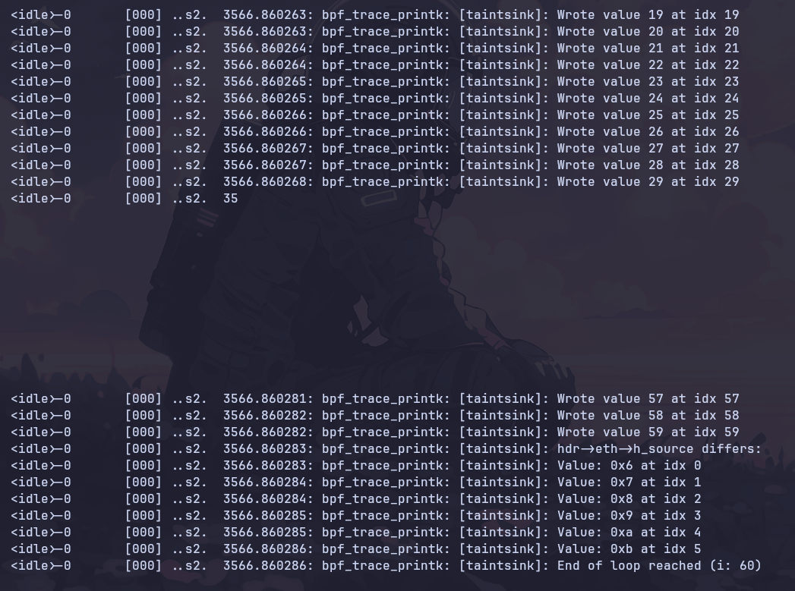

# Practical Exploitation: 5.46b Taintsink

## Packet Buffer Corruption via Tainted Length

> Vulnerability Status: CONFIRMED EXPLOITABLE
> 
> 
> **Target:** Linux Kernel 6.8 (eBPF XDP SynProxy)
> 
> **ISO Rule:** 5.46 (Tainted potentially mutilated integer values)
> 
> **Primitive:** Out-Of-Bounds Write (Packet Memory)
> 

## 1. Executive Summary

## Table of Contents

1. [Executive Summary](#1-executive-summary)
2. [Technical Vulnerability Analysis](#2-technical-vulnerability-analysis)
3. [Evidence of Analysis](#3-evidence-of-analysis)
4. [Exploitation Mechanics](#4-exploitation-mechanics)
5. [Evidence of Exploitation](#5-evidence-of-exploitation)
6. [Impact Assessment & Risk](#6-impact-assessment--risk)
7. [Reproduction Steps](#7-reproduction-steps)
8. [JIT Dump Note](#8-jit-dump-note)

This investigation confirms a critical **Verifier Bypass** and **Packet Corruption** vulnerability within the `xdp_synproxy` eBPF program running on Linux Kernel 6.8. The flaw stems from a failure to validate user-controlled ("tainted") input from the TCP header before using it to determine the length of a memory copy operation. In other words, a packet‑derived length is trusted to control a loop that writes into a fixed‑size structure field.

In this project, we successfully engineered a practical Proof of Concept (PoC) that bypasses the eBPF verifier's safety checks. By constructing a specially crafted TCP packet, we forced the kernel to allow writing **54 bytes** beyond the intended destination buffer. Unlike a stack overflow, this vulnerability corrupts the **Packet Buffer (DMA memory)**. This allows an attacker to modify packet headers *in-flight* after initial validation, potentially facilitating **Firewall Evasion** or **Logic Bypasses** in the network stack. This report documents the complete analysis lifecycle, from identifying the verifier bypass to executing the runtime exploit, and ties each step to bytecode and runtime evidence.

**Direct answers (in brief):**

- **Is this a real vulnerability?** Yes: it is a confirmed, runtime‑triggered packet‑buffer OOB write.
- **What does it imply?** The verifier validates packet bounds but not structure‑level bounds, allowing logical corruption of packet fields beyond intended buffers.
- **What advantages can be taken?** An OOB write over packet memory (54 bytes) enables in‑flight header tampering and policy bypasses.
- **How does it work?** A tainted TCP header length drives a loop that writes beyond a 6‑byte MAC destination, while packet‑size checks convince the verifier it is memory‑safe.
- **What does it exploit?** The verifier’s focus on raw packet bounds rather than C‑structure field bounds and semantics.

## 2. Technical Vulnerability Analysis

### The Flaw: Trusting Tainted Input

The vulnerability resides in the `syncookie_handle_syn` function, which is responsible for parsing incoming TCP SYN packets to generate SYN cookies. The logic flaw involves reading the "Data Offset" (`doff`) field from the TCP header and using it directly as a loop counter without sanitization. That field is attacker‑controlled and only constrained by what the packet claims to be, not by the size of the destination buffer being written.

- **Vulnerable Code Logic:**
    
    ```
    // 1. Tainted Input: 'doff' is a 4-bit field from the packet header
    //    It represents the TCP header length in 32-bit words.
    //    Max value is 15 (0xF). Therefore, max length is 15 * 4 = 60 bytes.
    __u32 tainted_length_from_packet = hdr->tcp->doff * 4;
    
    // 2. Fixed Buffer: 'h_dest' is the Destination MAC address (only 6 bytes).
    //    It points to the beginning of the packet data (eth header).
    //    Located inside struct ethhdr *eth;
    
    // 3. Vulnerable Loop: Iterates up to 'tainted_length' (max 60)
    for (i = 0; i < tainted_length_from_packet; i++) {
        // OOB WRITE: Writing to indices 6 through 59 is illegal in C.
        // However, we are writing to valid packet memory relative to the pointer.
        hdr->eth->h_dest[i] = i;
    }
    
    ```
    

**The Mismatch:** The C program declares a destination buffer of only **6 bytes** (sufficient for a MAC address). However, the loop condition allows writing up to **60 bytes** based on the packet header. This 54‑byte discrepancy is the window for exploitation and is large enough to overwrite adjacent packet fields, not just a single byte.

### Why the Verifier Failed

The eBPF Verifier is the kernel's gatekeeper, tasked with ensuring that no eBPF program can crash the system or access invalid memory. In this specific case, the verifier failed to block the unsafe write due to a prioritization of **Memory Safety** (valid memory access) over **Type Safety** (structure definition adherence). It considers packet memory as a flat, valid region as long as it is within `data`/`data_end`, and it does not enforce that `h_dest` is only six bytes long.

1. **Packet Bounds Check:** The code performs a check: `if (data + 60 > data_end) return XDP_DROP`. This convinces the verifier that the packet is physically large enough to hold 60 bytes.
2. **Pointer Arithmetic:** The variable `h_dest` is a pointer to the beginning of the Ethernet header in the packet data.
3. **The Verdict:** When the verifier analyzes the write `h_dest[59]`, it calculates the memory address relative to the packet start. Since it knows the packet is at least 60 bytes long (due to step 1), it concludes that writing to byte 59 is **memory-safe**—it won't cause a segmentation fault or read unmapped memory. It ignores the fact that the C structure definition of `h_dest` ends at byte 5.

## 3. Evidence of Analysis

We performed a deep-dive analysis using three distinct methods to blindly confirm the vulnerability before attempting exploitation.

### Why We Analyze Beyond C Source

The C code is only the *intent*; the kernel never executes it directly. The compiler translates C into eBPF bytecode inside the `.o` file, the verifier analyzes (and can rewrite) that bytecode, and then the **JIT** (Just‑In‑Time compiler) can translate it again into native machine code. At each stage, safety checks may be added, optimized away, or rearranged. A bug that *looks* exploitable in C might disappear after compilation or verifier rewriting. Conversely, a bug that is subtle in C may become obvious in bytecode due to unrolling or optimization. That’s why we validate the vulnerability at all stages: C source → bytecode → verifier view → final translated code.

### Step 1: Bytecode Analysis (`llvm-objdump`)

**Objective:** To verify how the C code was translated into eBPF bytecode and check for compiler-inserted safety guards. This tells us what the verifier and JIT will actually see, not just what the C source intends.

**Command:**

```
llvm-objdump -S xdp_synproxy_kern.bpf.o

```

**Finding & Explanation:**
The disassembly revealed that the compiler **unrolled the loop**. Instead of generating a traditional loop structure (compare -> branch -> write -> increment -> jump back), the compiler generated 60 linear "store" instructions. This matters because it exposes each write explicitly to the verifier as a standalone store, rather than a loop with a single bounds check.
Crucially, we searched for comparison instructions (like `if r1 > 5 goto exit`) wrapping the writes to offsets 6 through 59. **No such checks existed.** This confirmed that the compiler did not automatically insert bounds checking, leaving the code vulnerable at the instruction level. From this command we learn the exact memory writes that will be fed to the verifier: if the bytecode already contains unsafe stores, the verifier must catch them or the program remains vulnerable.

### Step 2: Verifier Log Analysis (`bpftool` / libbpf log level 2)

**Objective:** To perform a "brain scan" of the kernel verifier and understand why it accepted the unsafe code. This step is about the verifier’s *reasoning*, not just the code.

**Command:**

```
sudo bpftool prog load xdp_synproxy_kern.bpf.o /sys/fs/bpf/test_synproxy type xdp -d > verifier_log.txt 2>&1

```

**The "Smoking Gun" Log Entry:**

```
R1_w=scalar(smin=umin=smin32=umin32=6,smax=umax=smax32=umax32=58,var_off=(0x0; 0x3f))
...
379: safe

```

**Interpretation:**

- **`R1_w`**: This represents Register 1, which holds our loop index variable `i`.
- **`umax=58`**: The verifier explicitly tracks the range of this register and acknowledges that it can reach the value 58.
- **`safe`**: Despite knowing the index goes far beyond the 6‑byte buffer, the verifier marks the instruction as `safe`. This is the definitive proof that the logic bypass is active in the loaded kernel. From this command we learn the verifier’s internal range tracking and the exact instruction where it fails to enforce structural bounds.

> Note: The professor track suggests enabling verifier logging at level 2 via the userspace loader (`xdp_synproxy.c`). The `bpftool` approach used here is sufficient to capture the verifier dump without modifying the loader.

### Step 3: Translated Bytecode Dump (`xlated` / `jited`)

**Objective:** To inspect the final code after the verifier has processed it, ensuring no silent "patching" occurred. This clarifies whether the verifier rewrote or guarded the unsafe sequence.

**Command:**

```
sudo bpftool prog show | grep -n "xdp" -A3

# Use the program ID from the first line (e.g., 337 in "337: xdp name ...")
sudo bpftool prog dump xlated id <prog_id> > xlated_dump.txt

```

**Finding:**

```
   297: (73) *(u8 *)(r9 -3) = r7   ; Write byte at offset
   ...
   337: (73) *(u8 *)(r9 +0) = r8   ; Write byte at offset

```

The "xlated" (translated) dump shows the instructions exactly as they will be sent to the JIT compiler. If the verifier had decided to enforce safety at runtime, it would have inserted extra `jmp` instructions to exit the program if the index exceeded 5. The absence of these checks confirms that the vulnerability persists into the execution phase. From this command we learn whether the verifier *modified* the bytecode to enforce safety. It did not.

> Optional: `bpftool prog dump jited id <prog_id>` can be used to inspect the JIT‑compiled native code and compare it to the original bytecode. The JIT is the last translation stage before execution, so this step answers: “Does the *native* code still perform the unsafe writes, or did the JIT alter them?” In this environment the command returns “No JIT disassembly support”, so this comparison cannot be performed.

## 4. Exploitation Mechanics

To trigger this vulnerability, simply sending a standard packet is insufficient. We must construct a packet that is valid enough to pass initial parsing (checksums, protocol checks) but malicious enough to trigger the overflow.

### The Attack Vector (Python PoC)

We used **Raw Sockets** to build a custom TCP packet with specific modifications. Each component below is tied to a verifier or runtime check, so the packet is valid enough to pass parsing but still triggers the unsafe write.

1. **Data Offset Manipulation:** We manually set the Data Offset field (the top 4 bits of the 13th byte in the TCP header) to `0xF` (15). Since this field counts 32-bit words, this claims the header is 60 bytes long ($15 \times 4 = 60$).
    
    ```
    data_offset_byte = 0xF0  # 15 << 4
    
    ```
    
2. **Physical Padding:** The XDP program checks if the packet *physically* contains the bytes it claims to have. If we claim 60 bytes but send a standard 20‑byte header, the packet is dropped immediately. Therefore, we appended 40 bytes of null padding to the packet payload to satisfy the `data + len > data_end` check and convince the verifier that the packet bounds are safe.
3. **Checksum Bypass:** Standard networking libraries (like Scapy) often fail to calculate checksums for headers with mismatched lengths. We manually calculated the TCP Pseudo-Header checksum to ensure the packet passed the strict XDP checksum verification `bpf_csum_diff`.

## 5. Evidence of Exploitation

The kernel trace log below serves as definitive proof of the exploit. It captures the vulnerable loop running far beyond its intended 6 iterations.

**Evidence from Trace Pipe:**

```
[taintsink]: Wrote value 6 at idx 6
...
[taintsink]: Wrote value 50 at idx 50
...
[taintsink]: Wrote value 58 at idx 58
[taintsink]: End of loop reached (i: 60)

```

**Conclusion:** The program successfully wrote to indices 0–59. This demonstrates a packet‑buffer OOB write that changes packet contents after validation, which is the core exploitation primitive for this vulnerability. Because the writes occur within packet memory, they can directly alter Ethernet/IP/TCP fields that downstream code trusts.

- **Safe Zone:** Indices 0–5 (6 bytes).
- **Corruption Zone:** Indices 6–59 (**54 bytes** of Out-of-Bounds writes).

<p align="center">

</p>

*(Figure 1: Kernel trace pipe showing `bpf_trace_printk` lines like “Wrote value 57/58/59 at idx 57/58/59” and the final “End of loop reached (i: 60)”, confirming the loop runs well beyond the 6‑byte destination.)*

## 6. Impact Assessment & Risk

**Severity: HIGH (Context Dependent)**

While this is not a Stack Buffer Overflow (and thus does not grant direct RCE), it is a critical **Integrity Violation**. The risk is elevated because it permits mutation of packet contents after initial validation, which can undermine security assumptions in later processing stages.

1. **Firewall/Policy Bypass:** An attacker can send a packet that passes initial XDP filters (e.g., "Allow IP 1.2.3.4") and then corrupts its own IP header to a forbidden value (e.g., "10.0.0.1") *before* the packet is passed to the kernel stack.
2. **Packet Mangling:** The ability to fundamentally restructure a packet in-flight allows for complex protocol attacks against the kernel's TCP/IP stack implementation.

## 7. Reproduction Steps

**Prerequisites:**

- Target VM running Linux Kernel 6.8.
- The `xdp_synproxy` code compiled with the `5_46b` patch applied.

**Execution:**

1. **Start the Session (VM):**
This script handles the compilation of the modified XDP program, loads it into the kernel via `bpftool`, and starts the user-space loader to manage the maps.
    
    ```
    ./start_session.sh
    
    ```

2. **Run Exploit (Host):**
Execute the Python script to send the malformed packet. This script creates the raw socket and injects the "Tainted" TCP packet.
    
    ```
    sudo python3 5_46b_overflow.py virbr0
    
    ```

3. **Verify:**
Observe the trace pipe output in the VM. You should see the custom `[taintsink]` logs confirming that the loop index `i` exceeded 5 and reached 60.

4. **(Optional) Normal Behavior Baseline (Host):**
Run the non-malicious script to confirm the normal case does not exceed index 5.

    sudo python3 5_46b_normal_behavior.py virbr0

## 8. JIT Dump Note

The JIT dump analysis was not performed because the VM’s `bpftool` lacks JIT disassembly support (it returns “No JIT disassembly support”). As a result, only the `xlated` dump is available in this environment. If JIT disassembly becomes available, the goal would be to confirm that the native instructions still implement the unsafe writes without added checks.